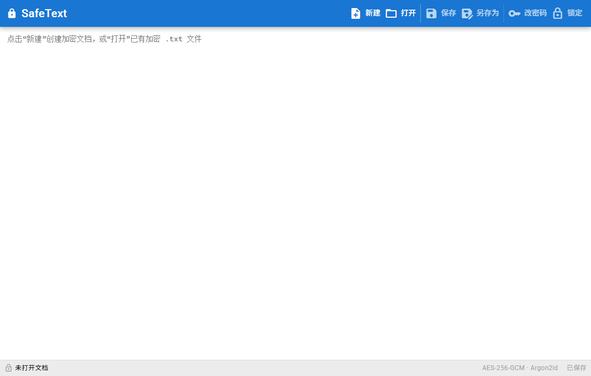
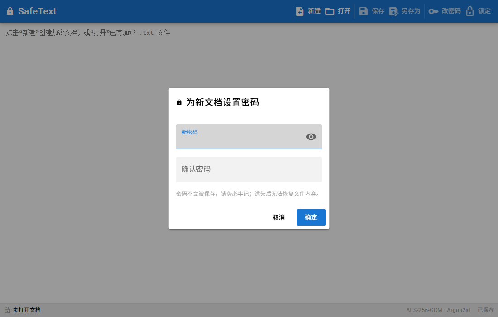

# SafeText · Transparently-encrypted TXT Notepad

**English** · [简体中文](README.zh-CN.md)

A tiny **portable, no-install** tool for encrypting a single `.txt` file. The encrypted file **can only be opened and edited by this app** — open it with Notepad, Notepad++, VS Code or anything else and you get garbage.

> Stack: **Quasar (Vue 3 + Vite) + Tauri 2**, with all crypto done on the Rust side
> Status: Windows / Android implemented and wired into GitHub Actions for automatic packaging + release (`cargo test` passing, desktop build passing locally)



---

## 1. Goals

- Encrypt a single `.txt` file, keeping the `.txt` suffix
- Only this app can open / edit it; every other editor shows garbage
- A wrong password refuses to open the file and shows a message
- Standard cryptography — no home-grown algorithms, no hard-coded keys

**Release targets**: Windows (`.msi` / `-setup.exe`) + Android (`.apk`), sharing the same Rust crypto code.

---

## 2. Features

| Feature | Description | Status |
|---|---|---|
| New | Set password → encrypt → save as `.txt` | ✅ |
| Open | Pick an encrypted file → enter password → decrypt to plaintext | ✅ |
| Edit | Edit directly in a multiline text box | ✅ |
| Save | Re-encrypt and write back to the same file (new nonce, no need to re-enter the password) | ✅ |
| Save As | Encrypt to a new path | ✅ |
| Change password | New salt + new key, re-encrypt and write back | ✅ |
| Lock | Clear the UI and drop the key | ✅ |
| Drag & drop open | Drop a file onto the window → password prompt | ✅ (desktop) |
| Idle auto-lock | 5 minutes by default; clears and drops the key | ✅ |
| Keyboard shortcuts | Ctrl+N / O / S / Shift+S / L | ✅ |
| Recent files | Opt-in and off by default; once enabled, reopened paths are listed in the toolbar with a one-click **Clear** | ✅ (desktop) |
| Settings | Auto-lock minutes + the opt-in "remember recent files" toggle | ✅ |

> Privacy: the **"recent files" list is opt-in and off by default**. When enabled it stores file paths in the local settings file only, and disabling it (or **Clear**) wipes them immediately — so by default no paths are ever persisted.

---

## 3. Security design

| Item | Implementation |
|---|---|
| Cipher | **AES-256-GCM** (authenticated encryption; a 16-byte tag at the end of the ciphertext) |
| Key derivation | **Argon2id**, random 16-byte salt, defaults m=64 MiB / t=3 / p=1 |
| Randomness | `getrandom` (OS CSPRNG) for salt / nonce |
| Integrity | The first 48-byte header is used as the **GCM AAD**; tampering with the header fails decryption |
| File format | Fixed 48-byte header (salt + nonce + params + version), ciphertext after it |
| Memory safety | Derived keys are wrapped in `zeroize::Zeroizing` and wiped on lock / exit |
| Never | No home-grown crypto, no hard-coded keys, no stored passwords |
| Password | Not stored, no backdoor; if lost, it is **permanently unrecoverable** |

---

## 4. Tech stack

| Layer | Choice | Version |
|---|---|---|
| UI framework | Quasar (Vue 3 + Vite, `@quasar/app-vite`) | quasar 2.35 / app-vite 3.10 |
| Native shell | Tauri 2 (Rust, `edition 2024`) | tauri 2.12 / tauri-build 2.7 |
| File dialogs | `tauri-plugin-dialog` | 2.8 |
| File I/O | `tauri-plugin-fs` (desktop + Android `content://`) | 2.6 |
| Logging | `tauri-plugin-log` | 2 |
| Symmetric crypto | `aes-gcm` (AES-256-GCM) | 0.11 |
| Key derivation | `argon2` (Argon2id) | 0.6 |
| Randomness | `getrandom` (OS CSPRNG) | 0.4 |
| Memory wiping | `zeroize` | 1 |
| Settings storage | Hand-rolled portable-first JSON (see §8) | — |

**Key decisions**
- Crypto lives in **Rust**: Argon2id (not available in WebCrypto), reliable wiping via `zeroize`, and one shared implementation for desktop and Android.
- **File I/O lives in frontend plugins**: read / write via the `dialog` + `fs` plugins, which naturally support Android `content://` URIs; the crypto commands only exchange bytes and never touch the filesystem (easy to unit test).
- Drag & drop (and recent-list) opens are read/written by the Rust `read_file` / `write_file` commands, since those paths have no dialog-authorized fs scope; dialog-opened files keep using the fs plugin.
- The "recent files" list is **opt-in and off by default**; enabling it stores only file paths in the local settings file, and disabling it (or **Clear**) wipes them.

---

## 5. File format v1 (fixed 48-byte header, big-endian)

```
Offset Length Field
0      4      Magic "STXT"
4      1      version = 0x01
5      1      KDF id = 0x01 (Argon2id)
6      1      cipher id = 0x01 (AES-256-GCM)
7      1      reserved (0)
8      4      Argon2 m_cost (KiB, default 65536)
12     4      Argon2 t_cost (default 3)
16     4      Argon2 p_cost (default 1)
20     16     salt
36     12     nonce / IV
48     ..     ciphertext + 16-byte GCM tag
```

- The first 48 bytes are used as the GCM **AAD**; a tampered header fails decryption
- Every save generates a **new nonce**; "change password" regenerates the salt + key
- Bad magic → `not a valid encrypted file`; GCM check fails → `wrong password or corrupted file`
- Params are stored in the header, so old files stay readable if the defaults are changed later

---

## 6. UI

The main window is shown at the top of this README. The password box used for New / Change password:



- Top toolbar `q-toolbar` + `q-btn`: New / Open / Recent / Save / Save As / Change password / Lock / Settings
- "Recent" opens a menu of remembered files (off by default; opt in via Settings) with a Clear action
- Settings dialog: auto-lock minutes + the "remember recent files" toggle
- A single full-window multiline text box in the middle (monospace)
- Bottom status bar: file name, lock state, save state, algorithm label
- Password box `q-dialog`: double-entry confirmation and length validation for New / Change; the title bar shows the file name + `*` (unsaved)

---

## 7. Cross-platform handling

| Aspect | Desktop | Android |
|---|---|---|
| Pick file | Native dialog (dialog plugin) | SAF (`text/plain`), returns `content://` |
| Read / write | fs plugin (path) | fs plugin (`content://`) |
| Open entry point | Drag & drop a file | Share Intent (`ACTION_VIEW` / `ACTION_SEND`, TODO) |
| Auto-lock | Idle timer | Idle timer + `onPause/onStop` (TODO) |
| Settings storage | Portable-first, else the system config dir | App config dir |

**Text handling**: read as bytes → validate header → decrypt → UTF-8 decode. Non-UTF-8 input (e.g. GBK) produces an explicit "content is not valid text" message instead of silent corruption.
**Known limitation**: the HTML `textarea` normalizes CRLF to LF, so saving after editing may change line endings; a BOM is preserved as `U+FEFF`.

---

## 8. Project layout

```
safe-text/
  package.json          quasar.config.js      index.html
  src/
    App.vue
    pages/IndexPage.vue                 # editor page (toolbar + textarea + password dialog + auto-lock + drag & drop)
    services/backend.js                 # calls Rust commands & Tauri plugins (dialog / fs / drag & drop)
    router/{index.js,routes.js}
    css/{app.scss,quasar.variables.scss}
  src-tauri/
    Cargo.toml  tauri.conf.json  build.rs
    capabilities/default.json
    src/
      main.rs      # desktop entry point
      lib.rs       # Builder: registers plugins, commands, session state
      commands.rs  # commands exposed to the frontend
      session.rs   # session state: Zeroizing key + salt + params
      crypto.rs    # Argon2id + AES-256-GCM (with unit tests)
      format.rs    # 48-byte header encode / decode
      settings.rs  # settings (portable-first on desktop)
      errors.rs    # errors → Chinese messages
  README.md
  README.zh-CN.md
  docs/         # UI screenshots referenced by the README
```

### Command interface (Rust → frontend `invoke`)

| Command | Purpose |
|---|---|
| `new_document(password, text)` | New encrypted document; unlock the session; return ciphertext bytes |
| `open_document(password, data)` | Decrypt; unlock the session; return plaintext |
| `save_document(text)` | Re-encrypt with the cached key (new nonce); return ciphertext bytes |
| `change_password(new_password, text)` | New salt + key, re-encrypt; update the session |
| `lock()` | Clear and wipe the session key |
| `probe_file(data)` | Structural probe: is this a SafeText file? |
| `read_file(path)` | Read a file by path (for drag & drop / recent files) |
| `write_file(path, data)` | Write bytes by path (for drag & drop / recent files) |
| `load_settings()` / `save_settings(settings)` | Read / write settings (paths are wiped when "remember recent" is off) |
| `add_recent_file(path)` | Record a path in the opt-in recent list (no-op unless enabled) |
| `clear_recent_files()` | Forget every remembered path |

---

## 9. Build & verify

### Prerequisites

- Node ≥ 22, Rust ≥ 1.90, Tauri 2 system dependencies
- On Windows you need the MSVC linker (build inside a `vcvars64.bat` environment)

### Desktop

```bash
npm install
npm run tauri:dev      # native dev window (runs quasar dev, then starts Tauri)
npm run tauri:build    # produces the desktop installer / exe
npm run build          # build the frontend SPA only (outputs dist/spa)
```

`src-tauri/tauri.conf.json` is configured with: `beforeDevCommand = npm run dev`, `devUrl = http://localhost:9000`, `beforeBuildCommand = npm run build`, `frontendDist = ../dist/spa`.

### Android

Locally you need the Android SDK + NDK + JDK (Tauri 2 does not require a separate `cargo-ndk`):

```bash
npm run tauri -- android init
npm run tauri -- android build --apk
```

- Prerequisites: Android SDK + NDK + JDK 17+ + android rust targets (`aarch64-linux-android`, etc.; Tauri installs them on demand).
- Without an emulator / device you can only compile the APK, not actually run it.
- On release, GitHub Actions automatically does `android init` → `build --apk` → signs with the key from the repo Secrets via `apksigner` → uploads to the same Release.

> ⚠️ The release build is not signature-verified, so installing it shows an "unknown source" prompt. Keep your signing key safe (repo Secrets `ANDROID_KEYSTORE_*`); future versions must use the same key to update in place.

### Verification

1. `cargo test` (in `src-tauri/`): round-trip, wrong-password rejection, tamper detection, header tampering, magic check, truncation error, empty content
2. Manual desktop test: New → Save → open in Notepad (garbage) → reopen in this app (fine) → change password → reopen (fine)
3. Android: CI compiles and signs the APK (cannot be tested locally without SDK/NDK — a known limitation)

---

## 10. Known risks / TODO

1. **Android behavior not tested on a real device**: CI compiles and signs the APK, but there is no emulator / device; runtime behavior (especially `content://` read / write and auto-lock) needs real-device verification.
2. **Writing back to Android `content://`** hits a known plugin issue (plugins-workspace #3356); if it bites, switch to `tauri-plugin-android-fs` or add a small Kotlin/JNI shim.
3. **Share Intent** (opening directly from the Android file manager) is not implemented yet.
4. **App-level CSP** is currently disabled to keep Tauri IPC stable; it can be tightened later via `app.security.csp` in `tauri.conf.json`.
5. **CRLF line endings** may be normalized to LF after editing and saving (see §7).

---

## 11. Security notes

- Losing the password = the file is **permanently unrecoverable**; the app stores no password and has no backdoor
- Keep an unencrypted backup of important files
- Do not use unknown third-party "encryption algorithms"
